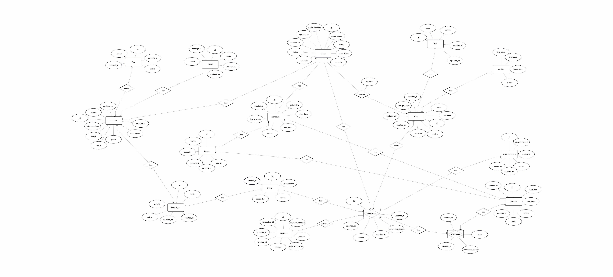

# DATABASE DESIGN  
## Language Center Management System

---

## 1. Overview  

### 1.1 Purpose  
Mô tả mục đích của tài liệu: thiết kế cơ sở dữ liệu cho hệ thống.

### 1.2 Scope  
Phạm vi dữ liệu được quản lý trong hệ thống.

---

## 2. ER Design  

### 2.1 Entity List  
Liệt kê các thực thể chính trong hệ thống.

### 2.2 ER Diagram  
Chèn hình ERD và ghi chú ngắn giải thích tổng quan quan hệ giữa các thực thể.

---

## 3. Table Design  

### 3.1 Table: <Table Name>  

**Description**  
Mô tả bảng này dùng để lưu thông tin gì.

**Columns**

| Column Name | Data Type | Null | Key | Description |
|------------|-----------|------|-----|-------------|
|            |           |      |     |             |

**Primary Key**  
Ghi khóa chính của bảng.

**Foreign Keys**  
Ghi khóa ngoại và tham chiếu đến bảng nào.

(Lặp lại mục 3.x cho mỗi bảng.)

---

## 4. Relationships  

Mô tả quan hệ giữa các bảng:  
- One-to-many  
- Many-to-many  
- One-to-one  

---

## 5. Constraints  

Liệt kê các ràng buộc quan trọng:  
- Primary Key  
- Foreign Key  
- Unique  
- Check  
- Not Null  

---

## 6. Normalization (Nếu cần)  

Giải thích ngắn hệ thống đạt đến 1NF, 2NF, 3NF như thế nào.

---
