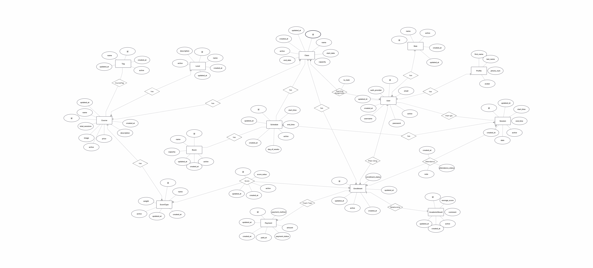

# SOFTWARE REQUIREMENTS SPECIFICATION (SRS)
## Language Center Management System

---

# 1. Introduction

## 1.1 Purpose
Việc xây dựng hệ thống được triển khai nhằm hướng đến các mục tiêu trọng tâm trong công tác quản lý và vận hành trung tâm. Giúp tin học hóa toàn bộ các hoạt động quản lý, thay thế phương pháp thủ công truyền thống bằng quy trình xử lý tự động, chính xác và tiết kiệm thời gian. 

Đối với nhóm người dùng là học viên, hệ thống hỗ trợ đăng ký khóa học, xem thời khóa biểu và theo dõi kết quả học tập trực tuyến. Đối với giáo viên, hệ thống tạo điều kiện thuận lợi trong việc quản lý lớp học, điểm danh và nhập điểm nhanh chóng, giảm thiểu sai sót. Bên cạnh đó, hệ thống còn hỗ trợ Admin trong việc quản lý chương trình đào tạo, học phí và lập các báo cáo thống kê. Giúp nâng cao hiệu quả hoạt động và chất lượng quản lý của trung tâm.

## 1.2 Scope
Hệ thống bao gồm các chức năng phục vụ cho ba nhóm người dùng chính: giáo viên, học viên và Admin. Hệ thống cho phép giáo viên thực hiện các thao tác liên quan đến lớp học như xem thông tin lớp, điểm danh và nhập điểm cho học viên. Học viên có thể đăng ký khóa học, xem thời khóa biểu và tra cứu kết quả học tập. Admin quản lý chương trình đào tạo, theo dõi và quản lý học phí, thực hiện lập các báo cáo thống kê.
## 1.3 Definitions, Acronyms, Abbreviations

|   Term   |          Meaning           |
|----------|----------------------------|
|   Admin  |  Quản trị viên             |
| Username |  Tên người dùng hệ thống   |
| Fullname |  Tên đầy đủ của người dùng |
---

# 2. Overall Description

## 2.1 Product Perspective
Hệ thống là một ứng dụng web độc lập được phát triển bằng framework Django. Người dùng truy cập và sử dụng thông qua trình duyệt web.

Ứng dụng được xây dựng theo kiến trúc Client–Server. Phía server chịu trách nhiệm xử lý logic nghiệp vụ và giao tiếp với cơ sở dữ liệu, trong khi phía client hiển thị giao diện và gửi yêu cầu đến server thông qua giao thức HTTP.

Hệ thống sử dụng hệ quản trị cơ sở dữ liệu MySQL để lưu trữ và quản lý dữ liệu.

Ứng dụng có tích hợp với các dịch vụ bên thứ ba nhằm mở rộng chức năng và đảm bảo tính bảo mật, bao gồm:

* Dịch vụ xác thực của Google để hỗ trợ đăng nhập bằng tài khoản Google.

* Cổng thanh toán Stripe để xử lý giao dịch thanh toán khóa học.

Các dịch vụ này được sử dụng thông qua API chính thức do nhà cung cấp phát hành.

Để vận hành, hệ thống yêu cầu môi trường server có cài đặt Python và Django. Người dùng cần có kết nối Internet để truy cập.

## 2.2 System Overview
Hệ thống được xây dựng nhằm hỗ trợ quản lý lớp học, học viên, học phí và lịch giảng dạy một cách hiệu quả, thay thế cho phương pháp quản lý thủ công trước đây. Ngoài ra, hệ thống còn cung cấp các chức năng hỗ trợ như báo cáo thống kê, nhập và lưu điểm học viên, cũng như điểm danh lớp học.

Hệ thống phục vụ các đối tượng người dùng bao gồm quản trị viên trung tâm, giáo viên và học viên. Mỗi nhóm người dùng được cung cấp các chức năng phù hợp với vai trò của mình.

Các chức năng chính của hệ thống bao gồm:

* Học viên có thể đăng ký khóa học trực tuyến và xem kết quả học tập.

* Giáo viên có thể nhập điểm và thực hiện điểm danh lớp học.

* Quản trị viên có thể quản lý học viên, giáo viên, lớp học và xem hoặc xuất báo cáo thống kê khi cần.

Hệ thống sử dụng cơ chế xác thực và phân quyền người dùng nhằm đảm bảo tính bảo mật và kiểm soát quyền truy cập theo từng vai trò.

## 2.3 User Roles

| Role | Description |
|------|------------|
| Admin | Quản lý toàn bộ hoạt động của hệ thống bao gồm quản lý học viên, giáo viên, lớp học, học phí và xem báo cáo thống kê. Có quyền truy cập cao nhất trong hệ thống. |
| Giáo viên | Quản lý lớp học được phân công, thực hiện nhập điểm, điểm danh và theo dõi kết quả học tập của học viên. |
| Học viên | Đăng ký khóa học trực tuyến, xem lịch học, thanh toán online, theo dõi kết quả học tập và thông tin cá nhân của mình. |

## 2.4 Assumptions & Constraints

### Assumptions
- Người dùng phải có kết nối Internet ổn định để truy cập hệ thống
- Server được cấu hình đúng và hoạt động liên tục trong quá trình sử dụng
- Người dùng cần có kiến thức cơ bản về sử dụng trình duyệt web
- Dữ liệu được nhập vào hệ thống là chính xác và hợp lệ.

### Constraints
- Hệ thống phải được phát triển bằng ngôn ngữ Python và framework Django theo định hướng công nghệ của dự án.
- Hệ thống bắt buộc sử dụng hệ quản trị cơ sở dữ liệu MySQL để đảm bảo tính nhất quán trong triển khai và kiểm thử.
- Phạm vi dự án chỉ bao gồm ứng dụng web, không phát triển phiên bản mobile hoặc desktop.
- Thời gian phát triển tối đa 8 tuần.
- Hệ thống hiện chưa tích hợp chức năng thanh toán trực tuyến thông qua các cổng thanh toán bên thứ ba.

---

# 3. System Features (Functional Requirements)

FR-01:  
FR-02:  
FR-03:  
FR-04:  
FR-05:  

---

# 4. External Interface Requirements

## 4.1 User Interface
- Phương thúc tương tác: người dùng thao tác bằng chuột, bàn phím khi sử dụng trên máy tính, laptop; thao tác bằng cảm ứng khi sử dụng trên thiết bị di động. Sử dụng menu, nút bấm, biểu mẫu để tương tác với hệ thống.
- Loại giao diện: Giao diện Web
- Giao diện:
  + Quản trị: 
    + Admin: Đăng nhập quản trị; Quản lý khóa học (học phí, chính sách, số lượng sinh viên, khóa học, điểm); Quản lý giáo viên, học viên; Báo cáo, thống kê.
    + Giáo viên: Đăng nhập quản trị; Quản lý lớp học, lịch giảng dạy; Điểm danh; Nhập điểm, nhận xét học viên.
  + Người dùng:
    + Học viên: Trang chủ; Đăng ký; Đăng nhập; Đăng ký khóa học, thanh toán; Xem lịch học, phòng học, profile; Xem điểm, kết quả học tập.
## 4.2 Hardware Interface
- Yêu cầu: thiết bị có khả năng kết nối Internet
- Thiết bị: Máy tính, Laptop, Điện thoại thông minh 
## 4.3 Software Interface
- Môi trường server: có cài đặt Python và Django
- Hệ quản trị cơ sở dữ liệu: MySQL
- Trình duyệt hỗ trợ: Google Chrome, Microsoft Edge,...
- Dịch vụ tích hợp: 
  + Dịch vụ xác thực đăng nhập (Google OAuth 2.0)
  + Dịch vụ xử lý thanh toán trực tuyến (Stripe API)

---

# 5. Non-functional Requirements

NFR-01: Yêu cầu giao diện
- Giao diện người dùng dễ sử dụng và phải đảm bảo tính đồng bộ về màu sắc, bố cục và font chữ trên tất cả các trang của hệ thống.
- Các thành phần giao diện (menu, nút chức năng, biểu mẫu nhập liệu) phải được thiết kế nhất quán giữa các chức năng.
- Hệ thống phải hiển thị thông báo lỗi rõ ràng và dễ hiểu khi nhập sai dữ liệu.

NFR-02: Bảo mật
- Hệ thống phải yêu cầu xác thực người dùng trước khi truy cập các chức năng quản lý (admin, giáo viên).
- Mật khẩu người dùng phải có ít nhất 6 kí tự. Mật khẩu phải được băm trước khi lưu trữ trong cơ sở dữ liệu

NFR-03: Hiệu năng
- Hệ thống phải hỗ trợ tối thiếu 200 người dùng truy cập đồng thời trong môi trường kiểm thử mà không xảy ra lỗi nghiêm trọng (server crash hoặc HTTP 500)
- Thời gian phản hồi trung bình cho mỗi yêu cầu không vượt quá 3 giây trong điều kiện tải bình thường. 

NFR-04: Độ tin cậy & khả năng bảo trì
- Hệ thống phải đảm bảo không mất dữ liệu khi xảy ra sự cố đột ngột.
- Hệ thống phải có cơ chế sao lưu cơ sở dữ liệu định kỳ (tối thiểu 1 lần/ngày).
- Việc cập nhật hệ thống không được làm ảnh hưởng đến các chức năng đã triển khai trước đó

---

# 6. Business Rules
Business Rules mô tả các quy tắc nghiệp vụ mà hệ thống phải tuân thủ trong quá trình vận hành.  

## 6.1. Phân quyền truy cập (Access Control)  
BR-01: Chỉ Admin được phép tạo khóa học.  
BR-02: Chỉ Admin được phép tạo lớp học.  
BR-03: Giảng viên chỉ được phép xem danh sách học viên lớp đang phụ trách hiện tại.  
BR-04: Học viên chỉ được phép xem điểm của bản thân.  
BR-05: Admin có toàn quyền quản trị hệ thống nhưng không được phép truy cập mật khẩu gốc của người dùng.    
BR-06: Giáo viên chỉ được phép nhập điểm của lớp đang phụ trách.  

## 6.2. Quản lý tài khoản người dùng (User Account Management)  
BR-07: Học viên được phép tự tạo tài khoản.  
BR-08: Học viên được phép chỉnh sửa thông tin cá nhân của mình.  
BR-09: Người dùng được phép xuất dữ liệu mà họ có quyền truy cập ra file (CSV/PDF).    
BR-10: Người dùng có quyền đổi mật khẩu của mình. Admin có quyền hỗ trợ khi người dùng gặp rắc rối.  

## 6.3. Quản lý lớp học (Class Management)  
BR-11: Chỉ Admin được quyền chỉnh sửa thông tin lớp học.  
BR-12: Không cho phép xóa lớp khi đã có học viên đăng ký.  
BR-13: Một lớp tối đa 30 học viên.  
BR-14: Một giáo viên được phép dạy tối đa 5 lớp học.    
BR-15: Học viên chỉ được xem các lớp học còn chỗ trống để đăng ký.    
BR-16: Không cho phép sắp xếp lịch học của các lớp trùng thời gian.  

## 6.4. Đăng ký khóa học/lớp học (Course/Class Registration)  
BR-17: Một học viên được quyền đăng ký nhiều lớp học nhưng không được trùng lịch học.  
BR-18: Việc đăng ký lớp học của học viên được xác nhận tự động sau khi thanh toán thành công.    
BR-19: Học viên chỉ được phép hủy đăng ký khóa học khi chưa thanh toán.  
BR-20: Trạng thái đăng ký bao gồm:  
 * Đăng ký thành công.  
 * Chờ thanh toán.  
 * Hết hạn.   
 * Đã hủy.

## 6.5. Thanh Toán (Payment)  
BR-21: Sau khi đăng ký khóa học, học viên thanh toán học phí trong 30 phút.  
BR-22: Quy định thanh toán học phí:  
 * Dưới 5 triệu VNĐ, học viên bắt buộc thanh toán toàn bộ học phí.  
 * Trên 5 triệu VNĐ, học viên được phép thanh toán một phần và thanh toán phần còn lại trong thời gian quy định.

BR-23: Trạng thái thanh toán gồm:   
 * Thanh toán thành công.  
 * Thanh toán thất bại.  
 * Chờ xử lý.  
 * Hủy thanh toán.  
 
## 6.6. Quản lý điểm (Grading)  
BR-24: Điểm của học viên phải nằm trong khoảng từ 0 điểm đến 10 điểm.  
BR-25: Chỉnh sửa điểm chỉ được phép khi:   
 * Chưa hết hạn nhập điểm.  
 * Có sai sót khi nhập điểm.  
 * Cập nhật điểm sau khi đã phúc khảo.

BR-26: Sau khi giáo viên submit bảng điểm, việc chỉnh sửa chỉ được thực hiện khi có quyền mở lại từ Admin.  
BR-27: Có quy định thời hạn nhập điểm cho giáo viên.  
BR-28: Admin được phép hỗ trợ mở lại quyền nhập điểm nếu có lý do hợp lý.  

## 6.7. Quy định hệ thống (System & Policy Management)    
BR-29: Admin được phép thay đổi chính sách học phí.  

## 6.8. Báo cáo (Reporting)  
BR-30: Hệ thống cung cấp báo cáo thống kê quý, năm theo:   
 * Tổng doanh thu.  
 * Tổng số lớp học.   
 * Tổng số học viên.   
 * Top giáo viên nổi bật theo số lượng lớp giảng dạy.  
  

---

# 7. Data Requirements

## 7.1 Data Entities

### 👤 Quản lý người dùng và phân quyền (User & Access Management) 
| Entity Name | Description |
|---|---|
| `User` | Đại diện cho người dùng sử dụng hệ thống. |
| `Profile` | Đại diện cho thông tin người sử dụng hệ thống. |
| `Role` | Đại diện cho vai trò người dùng trong hệ thống. |

### 📚 Quản lý khóa học (Course Management)
| Entity Name | Description |
|---|---|
| `Course` | Đại diện cho khóa học. |
| `Tag` | Đại diện cho các thẻ của khóa học. |
| `CourseTag` | Đại diện mối quan hệ giữa các thẻ và các khóa học. |
| `Level` | Đại diện cho mức độ của khóa học. |

### 🏫 Quản lý lớp học và lịch học (Class & Scheduling Management)
| Entity Name | Description |
|---|---|
| `Class` | Đại diện cho lớp học cụ thể của khóa học. |
| `Room` | Đại diện cho phòng học. |
| `Schedule` | Đại diện lịch học của lớp. |
| `Session` | Đại diện buổi học cụ thể của lớp. |
| `TeachingAssignment` | Thể hiện thông tin phân công giảng dạy cho giáo viên. |

### 💳 Đăng ký và thanh toán (Enrollment & Payment Management)
| Entity Name | Description |
|---|---|
| `Enrollment` | Thể hiện cho đăng ký khóa học. |
| `Payment` | Đại diện cho giao dịch thanh toán khóa học. |

### 🎓 Quản lý kết quả học tập (Academic Result Management)
| Entity Name | Description |
|---|---|
| `Attendance` | Đại diện cho sự điểm danh của học viên trong các buổi học. |
| `AcademicResult` | Đại diện kết quả học tập toàn khóa học của học viên. |
| `Score` | Đại diện thông tin điểm chi tiết. |
| `ScoreType` | Đại diện cho cột điểm số. |

---

## 7.2 Entity Attributes

### 7.2.1. User

| Attribute | Data Type | Description |
|---|---|---|
| id | int | Định danh duy nhất của thực thể |
| email | string | Địa chỉ email của người dùng |
| username | string | Tên đăng nhập của người dùng |
| password | string | Mật khẩu xác thực của người dùng |
| auth_provider | enum | Kiểu login của tài khoản |
| provider_id | string | Định danh xác thực từ Google |
| role_id | int | Vai trò người dùng |
| active | boolean | Trạng thái hoạt động của người dùng |
| created_at | datetime | Thời gian tạo tài khoản người dùng |
| updated_at | datetime | Thời gian cập nhật tài khoản người dùng gần nhất |

### 7.2.2. Profile

| Attribute | Data Type | Description |
|---|---|---|
| user_id | int | Định danh người dùng, đồng thời là khóa chính của hồ sơ |
| first_name | string | Tên người dùng |
| last_name | string | Họ người dùng |
| avatar | string | Ảnh đại diện của người dùng |
| phone_num | string | Số điện thoại người dùng |

### 7.2.3. Role

| Attribute | Data Type | Description |
|---|---|---|
| id | int | Định danh duy nhất của thực thể |
| name | string | Vai trò của người dùng |
| active | boolean | Trạng thái hoạt động của thực thể |
| created_at | datetime | Ngày tạo của thực thể |
| updated_at | datetime | Ngày cập nhật thông tin thực thể |

### 7.2.4. Course

| Attribute | Data Type | Description |
|---|---|---|
| id | int | Định danh duy nhất của khóa học |
| name | string | Tên khóa học |
| price | float | Giá của khóa học |
| description | string | Mô tả về khóa học |
| image | string | Hình ảnh khóa học |
| total_sessions | int | Tổng số buổi học |
| level_id | int | Trình độ của khóa học |
| active | boolean | Trạng thái hoạt động của thực thể |
| created_at | datetime | Ngày tạo của thực thể |
| updated_at | datetime | Ngày cập nhật thông tin thực thể |

### 7.2.5. Tag

| Attribute | Data Type | Description |
|---|---|---|
| id | int | Định danh duy nhất của thực thể |
| name | string | Tên thẻ |
| active | boolean | Trạng thái hoạt động của thực thể |
| created_at | datetime | Ngày tạo của thực thể |
| updated_at | datetime | Ngày cập nhật thông tin thực thể |

### 7.2.6. CourseTag

| Attribute | Data Type | Description |
|---|---|---|
| course_id | int | Xác định khóa học cụ thể. |
| tag_id | int | Xác định thẻ cụ thể. |

### 7.2.7. Level

| Attribute | Data Type | Description |
|---|---|---|
| id | int | Định danh duy nhất của thực thể |
| name | string | Mức độ |
| description | string | Mô tả về mức độ |
| active | boolean | Trạng thái hoạt động của thực thể |
| created_at | datetime | Ngày tạo của thực thể |
| updated_at | datetime | Ngày cập nhật thông tin thực thể |

### 7.2.8. Class

| Attribute | Data Type | Description |
|---|---|---|
| id | int | Định danh duy nhất của lớp học |
| name | string | Tên lớp học |
| start_date | date | Ngày bắt đầu của lớp học |
| end_date | date | Ngày kết thúc của lớp học |
| capacity | int | Số lượng học viên tối đa của lớp học |
| course_id | int | Khóa học mà lớp học thuộc về |
| active | boolean | Trạng thái hoạt động của thực thể |
| created_at | datetime | Ngày tạo của thực thể |
| updated_at | datetime | Ngày cập nhật thông tin thực thể |

### 7.2.9. Room

| Attribute | Data Type | Description |
|---|---|---|
| id | int | Định danh duy nhất của thực thể |
| name | string | Tên phòng học |
| capacity | int | Sức chứa của phòng |
| active | boolean | Trạng thái hoạt động của thực thể |
| created_at | datetime | Ngày tạo của thực thể |
| updated_at | datetime | Ngày cập nhật thông tin thực thể |

### 7.2.10. Schedule

| Attribute | Data Type | Description |
|---|---|---|
| id | int | Định danh duy nhất của thực thể |
| class_id | int | Xác định lịch học này của lớp học nào |
| start_time | datetime | Thời gian dự kiến bắt đầu của lịch học |
| end_time | datetime | Thời gian dự kiến kết thúc lịch học |
| room_id | int | Xác định phòng học cho lịch học |
| day_of_weeks | int | Xác định lớp học diễn ra vào thứ mấy |
| active | boolean | Trạng thái hoạt động của thực thể |
| created_at | datetime | Ngày tạo của thực thể |
| updated_at | datetime | Ngày cập nhật thông tin thực thể |

### 7.2.11. Session

| Attribute | Data Type | Description |
|---|---|---|
| id | int | Định danh duy nhất của thực thể |
| schedule_id | int | Xác định buổi học này được sắp xếp theo lịch học nào. |
| user_id | int | Xác định giáo viên dạy buổi học. |
| start_time | datetime | Thời gian bắt đầu thực tế của buổi học |
| end_time | datetime | Thời gian kết thúc thực tế buổi học |
| room_id | int | Xác định phòng học thực tế cho buổi học |
| date | date | Xác định buổi học này diễn ra vào ngày nào |
| active | boolean | Trạng thái hoạt động của thực thể |
| created_at | datetime | Ngày tạo của thực thể |
| updated_at | datetime | Ngày cập nhật thông tin thực thể |

### 7.2.12. TeachingAssignment

| Attribute | Data Type | Description |
|---|---|---|
| user_id | int | Định danh giảng viên được phân công. |
| class_id | int | Xác định lớp được phân công. |
| is_main | boolean | Xác định giáo viên chính của lớp. |

### 7.2.13. Enrollment

| Attribute | Data Type | Description |
|---|---|---|
| id | int | Định danh duy nhất của thực thể |
| user_id | int | Định danh của học viên đăng ký khóa học |
| class_id | int | Định danh của lớp học được đăng ký |
| enrollment_status | enum | Trạng thái đăng ký |
| active | boolean | Trạng thái hoạt động của thực thể |
| created_at | datetime | Ngày tạo của thực thể |
| updated_at | datetime | Ngày cập nhật thông tin thực thể |

### 7.2.14. Payment

| Attribute | Data Type | Description |
|---|---|---|
| id | int | Định danh duy nhất của thực thể |
| enrollment_id | int | Xác định thanh toán cho đăng ký nào |
| amount | float | Số tiền thanh toán |
| payment_method | enum | Phương thức thanh toán |
| payment_status | enum | Trạng thái thanh toán |
| transaction_id | string | Định danh từ cổng thanh toán |
| paid_at | datetime | Thời điểm thanh toán thành công |
| created_at | datetime | Ngày tạo của thực thể |
| updated_at | datetime | Ngày cập nhật thông tin thực thể |

### 7.2.15. Attendance

| Attribute | Data Type | Description |
|---|---|---|
| enrollment_id | int | Xác định học viên đã đăng ký lớp học của buổi học này |
| session_id | int | Xác định buổi học cụ thể của lớp học |
| attendance_status | enum | Trạng thái điểm danh |
| note | string | Ghi chú đối với các trường hợp cần chú thích thêm |
| created_at | datetime | Ngày tạo của thực thể |

### 7.2.16. AcademicResult

| Attribute | Data Type | Description |
|---|---|---|
| id | int | Định danh duy nhất của thực thể |
| enrollment_id | int | Xác định điểm thuộc về ai và lớp học nào |
| average_score | float | Điểm trung bình toàn khóa học |
| comment | string | Nhận xét của giáo viên |
| active | boolean | Trạng thái hoạt động của thực thể |
| created_at | datetime | Ngày tạo của thực thể |
| updated_at | datetime | Ngày cập nhật thông tin thực thể |

### 7.2.17. Score

| Attribute | Data Type | Description |
|---|---|---|
| id | int | Định danh duy nhất của thực thể |
| enrollment_id | int | Xác định điểm thuộc về ai và lớp học nào |
| score_value | float | Số điểm |
| score_type_id | int | Xác định cột điểm |
| active | boolean | Trạng thái hoạt động của thực thể |
| created_at | datetime | Ngày tạo của thực thể |
| updated_at | datetime | Ngày cập nhật thông tin thực thể |

### 7.2.18. ScoreType

| Attribute | Data Type | Description |
|---|---|---|
| id | int | Định danh duy nhất của thực thể |
| name | string | Tên cột điểm |
| weight | float | Hệ số của cột điểm |
| course_id | int | Thuộc khóa học nào |
| active | boolean | Trạng thái hoạt động của thực thể |
| created_at | datetime | Ngày tạo của thực thể |
| updated_at | datetime | Ngày cập nhật thông tin thực thể |

---

## 7.3 Relationships
- 
- 

## 7.4 Data Constraints
- 
- 

---

# 8. System Models

## 8.1 Use Case Diagram

## 8.2 Use Case Specification

## 8.3. ERD Diagram
